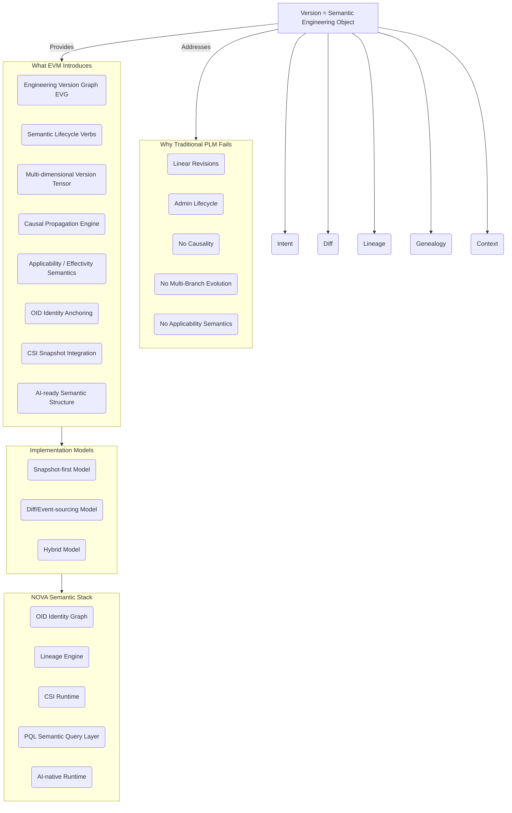

# **Engineering Versioning Model (EVM)**

## **Whitepaper — Executive Summary**

### *A One-Page Overview for Engineering Leadership*

---

# **Executive Summary**

Modern engineering organizations operate in a world defined by parallel development streams, variant-heavy product architectures, cross-domain dependencies, global regulatory pressure, rapid iteration cycles, and AI-driven automation. Yet most engineering systems still rely on revision counters and workflow states inherited from document control practices of the 1980s.

This gap has resulted in a structural limitation across PLM/MBSE ecosystems:

> **Engineering evolution is multi-dimensional and semantic.**\
> **Traditional revision models are linear and administrative.**

The **Engineering Versioning Model (EVM)** addresses this gap by introducing the first unified semantic model for engineering versioning.

---

# **What EVM Solves**

EVM provides a foundational framework for representing:

- **Intent** — the rationale for each change
- **Diff semantics** — structural, functional/behavioral, parametric, and rule/knowledge-based changes
- **Genealogy** — structural evolution across domains
- **Lineage** — causal propagation across engineering artifacts
- **Context** — applicability contexts such as configuration space, capability class, regulatory or operational contexts
- **Temporal positioning** — event-driven evolution

This transforms engineering versioning from a linear revision sequence into a:

- **multi-dimensional semantic tensor**, and
- **cross-domain engineering version graph (EVG)**.

---

# **Why Traditional PLM Versioning Falls Short**

Systems such as MatrixOne and Siemens’ Revision Rules provide:

- revision counters,
- workflow states,
- configuration selectors.

They do **not** provide:

- semantic meaning,
- causal relationships,
- multi-branch evolution,
- valid genealogy or structural mapping,
- cross-domain propagation logic,
- variant-aware applicability semantics.

EVM fills this structural void.

---

# **The EVM Graph (EVG)**

## **One-Page Semantic Overview Diagram (Mermaid)**



At runtime, EVM is expressed as an **Engineering Version Graph**, fusing:

- genealogy trees,
- lineage DAGs,
- applicability/context graphs,
- semantic diffs,
- temporal coordinates,
- identity anchoring (OID), into a single coherent, queryable, explainable engineering model.

---

# **Integration with the NOVA Semantic Stack**

EVM integrates with NOVA as the semantic core for:

- **OID identity management**
- **Lineage Engine** for causal propagation
- **CSI** (Causal Snapshot Integration) for reconstructing historical and hypothetical states
- **PQL** (Property Query Language) for semantic access
- **Semantic Cache / Runtime** for efficient execution

This creates a complete, AI-ready engineering infrastructure.

---

# **AI × EVM**

EVM enables AI to:

- understand engineering intent,
- classify semantic diffs,
- predict cross-domain impact,
- generate change narratives,
- validate configuration consistency,
- reason across multi-domain version graphs.

Without EVM’s semantic structure, engineering data is opaque to AI.

---

# **Use Cases Across Domains**

EVM applies consistently to:

- structural domain evolution
- multi-level structural or compositional evolution
- configuration and rule/knowledge evolution
- co-evolution of dependent components across domains
- process and operations domain evolution
- model-based and parametric evolution
- Compliance-driven modifications
- configuration updates across distributed or embedded systems
- digital-thread alignment across engineered identities

---

# **Why EVM Matters Now**

The future of engineering systems requires:

- semantic versioning,
- causal traceability,
- context-driven applicability,
- cross-domain propagation,
- multi-variant reasoning,
- AI-native interpretation.

EVM provides the **semantic foundation** enabling all of these.

> **EVM is not an enhancement to revision control — it is a redefinition of engineering version semantics for the next generation of PLM, MBSE, and AI-driven engineering.**

---

# **Optional Enhancements**

## **A. Core Insight Reinforcement**

> **EVM transforms engineering change from data management into causal, explainable knowledge.**

## **B. Visual Summary (At-a-Glance Diagram)**

```
Version = {
  intent,        // why the change exists
  diff,          // what changed
  lineage,       // what caused it
  genealogy,     // how structure evolved
  context        // where/when it applies
}

These five elements collectively form the **Semantic Version Quintet (EVM-5)** — the formal semantic basis of version meaning in engineering systems.
```

## **C. Storage-Agnostic Note**

> *EVM is implementation-neutral and supports both snapshot-first and diff-based realization models. Semantic consistency remains invariant across implementations.*

---

# **End of Executive Summary**

