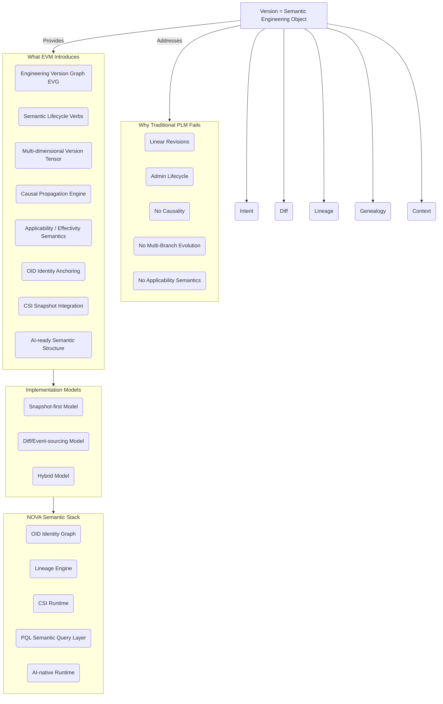

# **Engineering Versioning Model (EVM)**

## **Whitepaper — Foreword & Preface (Unified Edition)**

### *Semantic Foundations for Next-Generation Engineering Evolution*

---

# **Foreword**

For more than four decades, engineering systems—from PLM platforms to MBSE frameworks—have relied on a simple assumption: **versioning is a linear sequence of revisions governed by administrative workflows**. This assumption shaped the architectures of early-generation systems such as MatrixOne’s policy-driven major/minor model and Siemens’ Revision Rule–based configuration selection. These solutions succeeded in controlling maturity and approval processes, but they were never designed to express the **semantic structure** of engineering evolution.

A deeper examination of real-world engineering practice reveals a fundamental mismatch:

> **Engineering evolution is non-linear, multi-domain, context-driven, and causally motivated.**\
> **Traditional revision models are linear, isolated, and administratively motivated.**

The result is a structural gap at the core of modern product development—one that becomes increasingly problematic as products incorporate variant architectures, cross-domain dependencies, AI-enabled functions, and globally regulated configurations.

This whitepaper introduces the **Engineering Versioning Model (EVM)** as a response to this gap.\
EVM is not a refinement of existing revision practices; it is a complete semantic model of engineering evolution—**the missing layer** between PLM/MBSE systems and the engineering reality they attempt to represent.

---

# **Preface**

## **One-Page Semantic Overview Diagram (Mermaid)**


## **High-Level Architecture Overview (Semantic Stack View)**
```
EVM Semantic Architecture

┌──────────────────────────────────────────────────────────┐
│                      Version Semantics                   │
│  intent • diff • lineage • genealogy • context           │
└──────────────────────────────────────────────────────────┘
                │ binds
                ▼
┌──────────────────────────────────────────────────────────┐
│               Engineering Version Graph (EVG)            │
│  causal DAG • genealogy trees • applicability graph      │
│  temporal axes • semantic diff propagation               │
└──────────────────────────────────────────────────────────┘
                │ provides structure to
                ▼
┌──────────────────────────────────────────────────────────┐
│                Version Tensor (T × V × S)                │
│  time dimension • variant dimension • semantic dimension │
└──────────────────────────────────────────────────────────┘
                │ operates under
                ▼
┌──────────────────────────────────────────────────────────┐
│              Lifecycle & Propagation Semantics           │
│  derive • revise • supersede • merge • refactor          │
└──────────────────────────────────────────────────────────┘
                │ integrates with
                ▼
┌──────────────────────────────────────────────────────────┐
│                 NOVA Semantic Stack (Runtime)            │
│  OID graph • lineage engine • CSI reconstruction         │
│  PQL reasoning • AI-native semantic runtime              │
└──────────────────────────────────────────────────────────┘
```

Modern engineering products evolve simultaneously across multiple dimensions:

Modern engineering products evolve simultaneously across multiple dimensions:

- **Time** (ECR/ECO sequences, event-driven updates)
- **Variants** (markets, configurations, options)
- **Domains** (CAD, ECAD, BOM, firmware, rules, manufacturing)
- **Causality** (compliance triggers, supplier changes, field feedback)
- **Context** (effectivity, applicability conditions)
- **Semantics** (intent, rationale, structural meaning)

Yet traditional PLM-based versioning treats evolution as:

- a linear revision counter (A → B → C),
- with optional minor versions,
- governed by lifecycle states (In Work → Released),
- selected via configuration filters.

Systems such as MatrixOne exposed both the elegance and the constraints of this paradigm.\
The major/minor distinction offered flexibility, but the core assumption remained **a single mandatory linear chain of revisions**, with no native support for branching, merging, recontextualization, variant-driven evolution, causal propagation, or cross-domain synchronization.

Siemens’ Revision Rule addressed configuration selection—*which version is valid under which conditions?*—but selection is not semantics.\
It does not describe:

- why versions diverge,
- how they converge,
- how variants evolve structurally,
- how changes propagate across domains,
- or how intent shapes engineering outcomes.

These limitations are shared, implicitly or explicitly, across the PLM ecosystem.

---

# **Why EVM Must Exist**

The Engineering Versioning Model (EVM) is introduced to solve a problem that traditional PLM systems were never designed to address:

> **Engineering needs a versioning model that reflects how engineering actually evolves, not how documents are administratively revised.**

EVM defines a version as a **semantic engineering object**, not as a revision label.\
A version includes:

- **Intent** — why it exists
- **Diff** — what changed
- **Lineage** — how causality flows
- **Genealogy** — how structure transforms
- **Context** — where it applies
- **Lifecycle semantics** — how it evolves
- **Tensor coordinates** — its position in time, variant, and semantic space

This produces the first fully unified representation of engineering evolution.

EVM is realized operationally in the **Engineering Version Graph (EVG)**, which fuses:

- genealogy trees,
- causal lineage DAGs,
- effectivity & variant applicability graphs,
- semantic diff mappings,
- temporal progression,
- and identity anchoring (OID)

into a coherent, AI-readable, cross-domain engineering graph.

---

# **Toward an Engineering Standard**

EVM is more than an internal framework:\
it is a **candidate industry standard for semantic versioning**, providing a common language across:

- mechanical & electrical design,
- firmware & software,
- rules & configuration models,
- manufacturing processes,
- simulation parameters,
- and digital thread/digital twin ecosystems.

As engineering becomes increasingly AI-driven, globally distributed, variant-intensive, and context-governed, the need for a semantic versioning model is no longer optional—it is foundational.

EVM aims to provide that foundation.

This whitepaper presents EVM from first principles through operational implementation, culminating in its integration with the broader NOVA semantic stack and its applicability across multiple engineering domains.

---

## **Core Insight Reinforcement (Enhancement A)**

> **EVM reframes engineering evolution from a revision sequence into a causal, explainable, multi-dimensional semantic structure.**

## **Semantic Composition Diagram (Enhancement B)**

```
        ┌──────────────┐
        │    Intent    │  — why the change exists
        ├──────────────┤
        │     Diff     │  — what changed
        ├──────────────┤
        │    Lineage   │  — what caused it
        ├──────────────┤
        │  Genealogy   │  — how structure evolves
        ├──────────────┤
        │    Context   │  — where/when it applies
        └──────────────┘

     Version = Semantic Engineering Object
```

## **Implementation Neutrality Note (Enhancement C)**

> *EVM is implementation‑agnostic. Whether realized via snapshot‑first or diff‑based models, its semantic integrity remains unchanged.*

---

# **End of Foreword & Preface (Unified Edition)**

