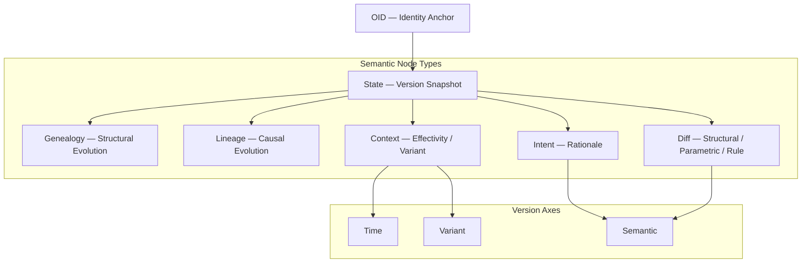
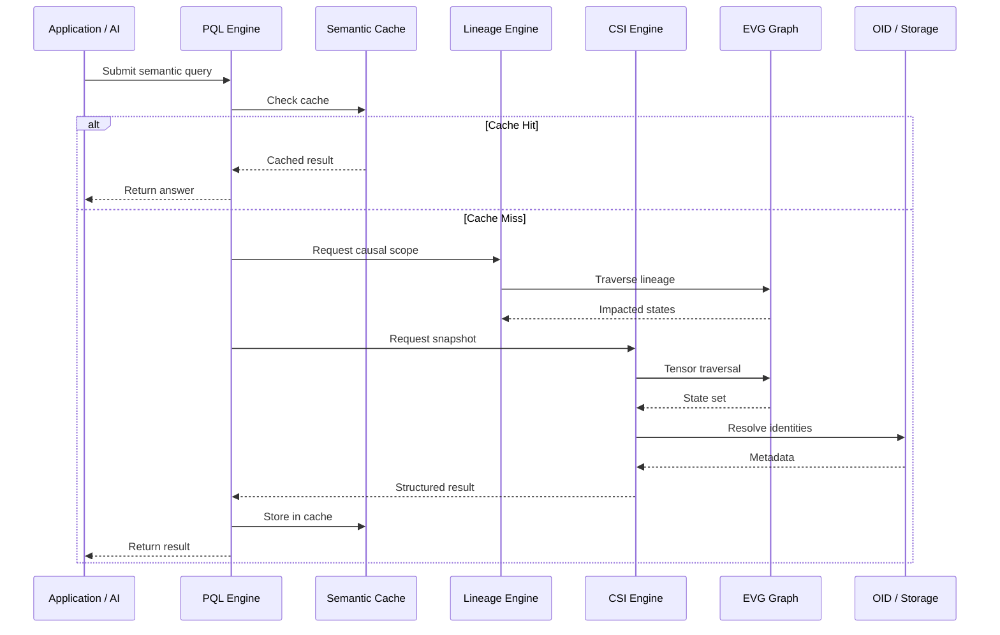
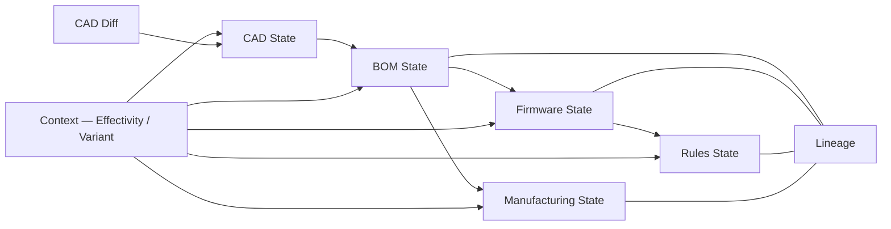

# **Chapter 5 — The Engineering Version Graph (EVG)**
### *Unified Semantic Graph for Engineering Evolution*

The Engineering Version Graph (EVG) is the **operational heart** of the Engineering Versioning Model (EVM). It transforms engineering evolution—traditionally scattered across CAD revisions, BOM updates, firmware commits, rules changes, and manufacturing processes—into a **single semantic network** governed by identity, causality, structure, intent, and context.

This chapter presents the **fully polished** EVG definition, integrating:
- EVG Architecture Overview
- Layered Semantic Stack View
- Runtime Query Flow
- Multi-Domain Change Propagation
- Node & Edge Taxonomy
- Tensor-based Version Coordinates

---

# **5.1 What EVG Represents**

EVG is a unified graph where **every engineering state**—across all domains and variants—is represented as a version node enriched with semantic attachments.

Each version node (State):
- Belongs to an **OID** (immutable identity),
- Has **Intent** (why it exists),
- Has **Diff** (what changed),
- Is part of **Lineage** (causal propagation),
- Is part of **Genealogy** (structural evolution),
- Is bound by **Context** (variant, market, effectivity),
- Is positioned within a **3-axis semantic coordinate system** (Time × Variant × Semantic).

**In short:**
> **EVG is the first model that captures engineering evolution as a multi-domain, multi-variant semantic graph with identity and causality.**

---

# **5.2 EVG Architecture Diagram (Canonical Form)**


---

# **5.3 EVG Layered Architecture (Semantic Stack View)**
```
┌───────────────────────────────────────────────┐
│  APPLICATION / AI LAYER                       │
│    - AI reasoning                             │
│    - validation & explanation                 │
└───────────────────────────────────────────────┘
                     │ PQL
                     ▼
┌───────────────────────────────────────────────┐
│  SEMANTIC RUNTIME                             │
│    - PQL Engine                                │
│    - Semantic Cache                            │
│    - Lineage Engine                            │
│    - CSI Engine                                │
└───────────────────────────────────────────────┘
                     ▼
┌───────────────────────────────────────────────┐
│  ENGINEERING VERSION GRAPH (EVG)              │
│    - State, Intent, Diff, Lineage, Genealogy  │
│    - Context nodes & Tensor coordinates       │
└───────────────────────────────────────────────┘
                     ▼
┌───────────────────────────────────────────────┐
│  OID — Stable Identity Anchor                 │
└───────────────────────────────────────────────┘
                     ▼
┌───────────────────────────────────────────────┐
│  STORAGE (GraphDB / KV Store / Index)         │
└───────────────────────────────────────────────┘
```

---

# **5.4 Runtime Query Flow (PQL → EVG → Lineage → CSI)**


---

# **5.5 Multi-Domain Propagation (CAD → BOM → Firmware → Rules → Manufacturing)**


---

# **5.6 Node Types and Their Semantics**

| Node Type | Purpose |
|-----------|---------|
| **State** | Concrete version of an engineering object |
| **Intent** | Why the version exists (rationale) |
| **Diff** | What changed (structural/parametric/rule) |
| **Lineage** | Causal chain linking events and states |
| **Genealogy** | Structural derivation & decomposition |
| **Context** | Applicability by variant/effectivity/market |
| **OID** | Immutable identity anchor |
| **Semantic Axes** | Coordinates: Time × Variant × Semantic |

---

# **5.7 Edge Types**

| Edge | Meaning |
|------|---------|
| `STATE → OID` | Identity affiliation |
| `STATE → INTENT` | Rationale attachment |
| `STATE → DIFF` | Change description |
| `STATE → LINEAGE` | Result of causal event |
| `STATE → GENEALOGY` | Structural evolution |
| `STATE → CONTEXT` | Applicability |
| `CONTEXT → VARIANT` | Variant constraints |
| `CONTEXT → TIME` | Time-bound applicability |
| `INTENT → SEMANTIC` | Semantic positioning |
| `DIFF → SEMANTIC` | Semantic positioning |

---

# **5.8 Why EVG Matters**

Traditional revisioning systems cannot:
- represent parallel variant evolution,
- model cross-domain propagation,
- express intent-driven engineering changes,
- distinguish diff semantics,
- maintain causality,
- encode genealogy,
- select versions by context/effectivity,
- support multi-branch engineering evolution.

EVG solves these limitations by providing a **semantic, graph-based representation** of engineering evolution.

---

# **5.9 Summary**

> **EVG is the semantic substrate of the entire EVM/NOVA ecosystem—identity-anchored, causally coherent, variant-aware, and AI-readable.**

