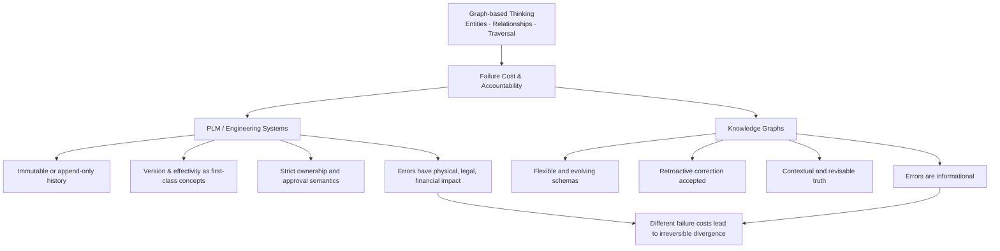

# Part IV — PLM vs Knowledge Graphs: A Cooling‑Down Perspective

## Executive Summary

Knowledge Graphs (KGs) are increasingly presented as a strategic breakthrough for enterprise AI, data governance, and even PLM. For those who have spent years working inside real PLM platforms, this enthusiasm feels misplaced.

PLM systems have *always* operated on linked, semantic data under far harsher constraints than those assumed by most Knowledge Graph initiatives. If PLM — built for engineering accountability, change control, and irreversible consequences — is deemed insufficient, it is difficult to argue that Knowledge Graphs can succeed where PLM already operates at its limits.

This paper aims to cool down the KG hype by clarifying the historical split between these two branches and grounding the discussion back in engineering reality.

---

## 1. Shared Roots: Graph Thinking Is Not New

Both PLM platforms and Knowledge Graphs originate from the same foundational idea:

- Entities with identity
- Typed relationships
- Traversal over flat CRUD access
- Meaning derived from connections, not rows

None of this is novel. PLM systems adopted these principles decades ago — long before the term “Knowledge Graph” entered mainstream vocabulary.

---

## 2. The Critical Fork: Failure Cost

The real divergence between PLM and KG was never about technology. It was about *risk tolerance*.

**PLM environments** operate under extreme failure cost:

- Incorrect structure can halt production
- Wrong effectivity can trigger recalls
- Invalid change history creates legal exposure

**Knowledge Graphs**, by contrast, evolved in domains where:

- Answers can be approximate
- Facts can be corrected retroactively
- Errors are informational, not operational

From this point onward, the two paths could not converge.

---

## 3. Visualizing the Divergence: PLM vs. Knowledge Graphs

*When systems evolve under fundamentally different failure costs, convergence becomes unlikely — regardless of shared origins.*

---

## 4. PLM as an Engineering‑Grade Semantic System

Modern PLM platforms already embody what many now rediscover as “semantic modeling”:

- Typed objects (Parts, Documents, Changes, Variants)
- Typed relationships (BOM, Affected, Resulting, Substitutes)
- Version, revision, and state as first‑class concepts
- Effectivity and context‑dependent validity
- Strict ownership and authorization semantics

The graph is not an add‑on in PLM. It is *native*.

---

## 5. Why Failure Cost Forces Temporal Semantics

High failure cost environments introduce constraints that fundamentally reshape semantic system design.

When incorrect meaning can trigger physical, financial, or legal consequences, systems must answer questions that cannot be resolved by structural connectivity alone:

- What was the approved truth at a specific moment?
- Can that truth be rewritten?
- Which downstream artifacts depend on that truth?
- Who authorized its validity?

These requirements naturally force the emergence of temporal semantic primitives:

- **Snapshot / Baseline Truth** — immutable anchors describing what was considered valid at a given time
- **Version Truth** — new truth must supersede prior truth rather than overwrite it
- **Append‑Only Change** — change is expressed through addition, not mutation
- **Lineage and Derivation** — relationships between states must remain explainable and auditable

These constructs are not implementation preferences. They are survival mechanisms.

When failure cost is low, systems can tolerate reinterpretation and retroactive correction. When failure cost is high, meaning must be preserved as evidence.

This is why PLM semantics evolved toward time‑anchored truth rather than purely structural representation.

---

## 6. Why KG Adds Little in the PLM Problem Space

Within PLM, the hardest semantic problems are already solved — or deliberately constrained:

- Identity is strict
- Semantics are owned
- Change is audited
- History is non‑negotiable

Introducing a Knowledge Graph does not create new engineering capability. At best, it re‑expresses existing semantics using different tooling. The marginal gain is often limited to visualization or exploratory querying — not system behavior.

---

## 7. The AI Era Misinterpretation

The resurgence of Knowledge Graphs is less about their novelty and more about AI exposing the limits of schema‑on‑read and ungoverned data.

In this context, KGs appear as a corrective force. But what they actually rediscover are long‑established engineering principles:

- Structure matters
- Semantics must be explicit
- Not all data is mutable

These principles were never missing from PLM.

---

## 8. Data Governance: PLM as the Original Discipline

Many modern data governance discussions mirror problems PLM addressed decades ago:

- Ownership
- Lifecycle
- Auditability
- Accountability

PLM remains one of the most mature large‑scale implementations of governed data. Treating Knowledge Graphs as a replacement rather than a late rediscovery misunderstands this history.

---

## Conclusion

Knowledge Graphs are powerful technologies.

However, their widespread positioning as a universal solution for engineering semantics often overlooks a deeper constraint: the cost of being wrong.

Engineering systems operate under conditions where truth must be preserved, auditable, and resistant to silent reinterpretation.

When evaluated solely through the lens of connectivity and flexibility, Knowledge Graphs appear transformative. When evaluated through the lens of failure cost and temporal truth, they often address a different class of problems.

This does not diminish their value.

It clarifies their domain of applicability.

Understanding this distinction allows both PLM and KG approaches to evolve without forcing convergence where structural divergence is inevitable.

